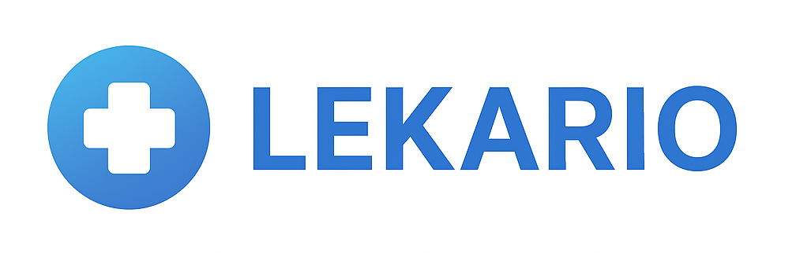

<div align="center">



# 🏥 Lekario
### System Zarządzania Przychodnią Lekarską


[](https://opensource.org/licenses/MIT)
[](http://makeapullrequest.com)

---

### 👥 Zespół

<table>
  <tbody>
    <tr>
      <td align="center" valign="top" width="14.28%">
        <a href="https://github.com/Raparinio">
          
          <br />
          <sub><b>Raparinio</b></sub>
        </a>
        <br />
        💻 🎨
      </td>
      <td align="center" valign="top" width="14.28%">
        <a href="https://github.com/Dantial">
          
          <br />
          <sub><b>Dantial</b></sub>
        </a>
        <br />
        💻 🗄️
      </td>
      <td align="center" valign="top" width="14.28%">
        <a href="https://github.com/ImSayvi">
          
          <br />
          <sub><b>ImSayvi</b></sub>
        </a>
        <br />
        💻 ⚙️
      </td>
      <td align="center" valign="top" width="14.28%">
        <a href="https://github.com/aiiimek">
          
          <br />
          <sub><b>aiiimek</b></sub>
        </a>
        <br />
        💻 🎨
      </td>
      <td align="center" valign="top" width="14.28%">
        <a href="https://github.com/Arczisork">
          
          <br />
          <sub><b>Arczisork</b></sub>
        </a>
        <br />
        💻 📖
      </td>
    </tr>
  </tbody>
</table>

---

</div>

## 📋 O Projekcie

**Lekario** to nowoczesna aplikacja webowa stworzona do kompleksowego zarządzania przychodnią lekarską. System umożliwia zarządzanie wizytami, pacjentami, lekarzami oraz całą dokumentacją medyczną z naciskiem na bezpieczeństwo danych osobowych zgodnie z wymogami RODO.

### 🎯 Kluczowe Cechy

- ✅ **Wielopoziomowa autoryzacja** - System ról (Pacjent, Lekarz, Administrator)
- 🔐 **Zaawansowane szyfrowanie** - AES-256 dla danych wrażliwych + SHA-256 dla haseł
- 📅 **Inteligentny system wizyt** - Rezerwacja, anulowanie i zarządzanie terminarzem
- 📊 **Dashboard z analityką** - Wykresy i statystyki w czasie rzeczywistym
- 💊 **Zarządzanie receptami** - Elektroniczny system recept
- 📱 **Responsywny design** - Pełna kompatybilność z urządzeniami mobilnymi
- 🗄️ **Procedury składowane** - Optymalizacja wydajności bazy danych
- 🔍 **Zaawansowane wyszukiwanie** - DataTables z filtrowaniem i sortowaniem

## ✨ Funkcjonalności

### 👤 Panel Pacjenta
- 📝 Rejestracja i logowanie z weryfikacją email
- 📅 Przeglądanie dostępnych terminów wizyt
- 🏥 Rezerwacja wizyt u wybranych lekarzy
- 📋 Historia wizyt i dokumentacja medyczna
- 💊 Przeglądanie recept elektronicznych
- ⚙️ Zarządzanie profilem i ustawieniami

### 👨‍⚕️ Panel Lekarza
- 📊 Dashboard z dziennymi statystykami
- 👥 Lista pacjentów i ich historie chorobowe
- 📅 Zarządzanie kalendarzem wizyt
- 📝 Wystawianie recept elektronicznych
- 📈 Raporty i analityka
- 🔔 Powiadomienia o nowych wizytach

### 🛡️ Panel Administratora
- 👨‍💼 Zarządzanie użytkownikami (pacjenci, lekarze, personel)
- 🏥 Konfiguracja systemu przychodni
- 📊 Globalne statystyki i raporty
- 🗄️ Zarządzanie bazą danych
- 🔐 Kontrola dostępu i uprawnień
- 📝 Logi systemowe i audyt

## 🛠️ Stack Technologiczny

### Backend
| Technologia | Wersja | Zastosowanie |
|------------|--------|--------------|
|  | 7.4+ | Logika serwera, API endpoints |
|  | 8.0+ | Baza danych, procedury składowane |

### Frontend
| Technologia | Wersja | Zastosowanie |
|------------|--------|--------------|
|  | 5 | Struktura stron |
|  | 3 | Stylizacja |
|  | ES6+ | Interakcje, AJAX |
|  | - | Preprocessor CSS |

### Biblioteki & Frameworki
| Biblioteka | Zastosowanie |
|------------|--------------|
|  **Bootstrap 4.6** | Responsywny layout, komponenty UI |
|  **jQuery 3.6** | Manipulacja DOM, AJAX requests |
|  **Chart.js 2.9** | Wykresy i wizualizacje danych |
|  **DataTables 1.10** | Zaawansowane tabele z filtrowaniem |
|  **FontAwesome 5** | Ikony i symbole |
| **jQuery Easing** | Animacje smooth scrolling |

### Dodatkowe Narzędzia
- **SB Admin 2** - Szablon panelu administracyjnego
- **Gulp.js** - Automatyzacja zadań (build, minifikacja)
- **Git** - Kontrola wersji

## 📁 Architektura Projektu

```
Aplikacja-przychodnia-lekarska/
│
├── 📂 assets/                      # Zasoby statyczne
│   ├── css/                        # Stylizacja
│   │   ├── custom.css              # Własne style
│   │   └── sb-admin-2.min.css      # Style szablonu
│   ├── js/                         # JavaScript
│   │   ├── base/                   # Główne skrypty
│   │   │   ├── dashboard.js        # Logika dashboardu
│   │   │   └── login.js            # Logika logowania
│   │   └── demo/                   # Wykresy i tabele
│   ├── scss/                       # SASS source files
│   └── vendor/                     # Biblioteki zewnętrzne
│       ├── bootstrap/
│       ├── chart.js/
│       ├── datatables/
│       ├── fontawesome-free/
│       └── jquery/
│
├── 📂 dbEssentials/                # Skrypty bazodanowe
│   ├── BDsql.sql                   # Schemat bazy danych
│   └── lekariodb.xml               # Eksport struktury
│
├── 📂 includes/                    # Komponenty PHP
│   ├── header.php                  # Nagłówek strony
│   ├── footer.php                  # Stopka
│   ├── sidenav.php                 # Menu boczne
│   └── logoutModal.php             # Modal wylogowania
│
├── 📂 model/                       # Warstwa modelu (MVC)
│   ├── Dashboard.php               # Model dashboardu
│   ├── Login.php                   # Model autoryzacji
│   └── Register.php                # Model rejestracji
│
├── 📂 SaySoft/                     # Core system
│   ├── dbconn.php                  # Połączenie z bazą danych
│   ├── master.php                  # Master config
│   └── pattern.js                  # Wzorce walidacji
│
├── 📂 sites/                       # Moduły aplikacji
│   ├── dashboard/                  # Panel główny
│   │   ├── index.php
│   │   ├── setVisit.php            # Umawianie wizyt
│   │   ├── cancelVisit.php         # Anulowanie wizyt
│   │   └── getDoctors.php          # Pobieranie listy lekarzy
│   ├── login/                      # Moduł logowania
│   ├── register/                   # Moduł rejestracji
│   └── patient/                    # Panel pacjenta
│
├── 📄 DB.sql                       # Główny skrypt SQL
├── 📄 ADMINdash.php                # Dashboard admina
├── 📄 DOCTOR.php                   # Panel lekarza
├── 📄 RECEPTY.php                  # Moduł recept
└── 📄 README.md                    # Ten plik

```

## 🔐 Bezpieczeństwo

### Mechanizmy Ochrony Danych

#### 🔒 Szyfrowanie
- **AES-256** - Szyfrowanie danych osobowych (email, nazwisko)
- **SHA-256** - Hashowanie haseł przed zapisem do bazy
- **Klucz szyfrujący** - Przechowywany bezpiecznie poza kodem źródłowym

#### 🛡️ Zabezpieczenia Aplikacji
- ✅ **Prepared Statements** - Ochrona przed SQL Injection
- ✅ **CSRF Protection** - Tokeny w formularzach
- ✅ **XSS Protection** - Sanityzacja input/output
- ✅ **Session Management** - Bezpieczne zarządzanie sesjami
- ✅ **Password Policy** - Wymuszanie silnych haseł
- ✅ **Role-Based Access Control (RBAC)** - Kontrola dostępu oparta na rolach

#### 📋 Zgodność z RODO
- 📝 Zgoda na przetwarzanie danych osobowych
- 🔐 Szyfrowanie danych wrażliwych
- 📊 Możliwość eksportu danych użytkownika
- 🗑️ Prawo do usunięcia danych (soft delete)
- 📝 Logi dostępu do danych medycznych

### Struktura Bazy Danych

#### Tabela: `tbusers`
```sql
CREATE TABLE tbusers (
  id CHAR(36) PRIMARY KEY,              -- UUID v4
  login CHAR(64) UNIQUE NOT NULL,       -- Login użytkownika
  email VARBINARY(255) NOT NULL,        -- Email (zaszyfrowany AES-256)
  password VARCHAR(255) NOT NULL,       -- Hasło (SHA-256)
  name VARCHAR(100),                    -- Imię
  surname VARBINARY(255),               -- Nazwisko (zaszyfrowane)
  role VARCHAR(50) DEFAULT 'patient',   -- Rola: patient/doctor/admin
  createdt TIMESTAMP DEFAULT NOW(),     -- Data utworzenia
  agreement TINYINT(1),                 -- Zgoda RODO
  confirmdt TIMESTAMP NULL,             -- Data potwierdzenia email
  status VARCHAR(50)                    -- Status: NEW/ACTIVE/BLOCKED
);
```

#### Procedury Składowane
- **`registerUser`** - Bezpieczna rejestracja z szyfrowaniem
- **`loginUser`** - Autoryzacja użytkownika
- **`getAvailableDoctors`** - Lista dostępnych lekarzy
- **`createVisit`** - Tworzenie nowej wizyty
- **`cancelVisit`** - Anulowanie wizyty


## 🤝 Contributing

Zachęcamy do współpracy! Jeśli chcesz dodać nową funkcjonalność lub naprawić błąd:

1. 🍴 Fork projektu
2. 🌿 Utwórz branch (`git checkout -b feature/AmazingFeature`)
3. 💾 Commit zmian (`git commit -m 'Add some AmazingFeature'`)
4. 📤 Push do brancha (`git push origin feature/AmazingFeature`)
5. 🎉 Otwórz Pull Request

### Zasady Contribution
- ✅ Kod zgodny z PSR-12 (PHP)
- ✅ Komentarze w języku polskim lub angielskim
- ✅ Testy jednostkowe dla nowych funkcji
- ✅ Dokumentacja dla API endpoints

## 📜 Licencja

Projekt jest dostępny na licencji **MIT License** - szczegóły w pliku [LICENSE](LICENSE).

```
MIT License

Copyright (c) 2025 Lekario Team

Permission is hereby granted, free of charge, to any person obtaining a copy
of this software and associated documentation files (the "Software"), to deal
in the Software without restriction...
```

## 👨‍💻 Autorzy & Współtwórcy

---

### 🤝 Kontrybutorzy

<table>
  <tbody>
    <tr>
      <td align="center" valign="top" width="14.28%">
        <a href="https://github.com/Raparinio">
          
          <br />
          <sub><b>Raparinio</b></sub>
        </a>
        <br />
        <a title="Code">💻</a>
        <a title="Design">🎨</a>
      </td>
      <td align="center" valign="top" width="14.28%">
        <a href="https://github.com/Dantial">
          
          <br />
          <sub><b>Dantial</b></sub>
        </a>
        <br />
        <a title="Code">💻</a>
        <a title="Database">🗄️</a>
      </td>
      <td align="center" valign="top" width="14.28%">
        <a href="https://github.com/ImSayvi">
          
          <br />
          <sub><b>ImSayvi</b></sub>
        </a>
        <br />
        <a title="Code">💻</a>
        <a title="Backend">⚙️</a>
      </td>
      <td align="center" valign="top" width="14.28%">
        <a href="https://github.com/aiiimek">
          
          <br />
          <sub><b>aiiimek</b></sub>
        </a>
        <br />
        <a title="Code">💻</a>
        <a title="Frontend">🎨</a>
      </td>
      <td align="center" valign="top" width="14.28%">
        <a href="https://github.com/Arczisork">
          
          <br />
          <sub><b>Arczisork</b></sub>
        </a>
        <br />
        <a title="Code">💻</a>
        <a title="Documentation">📖</a>
      </td>
    </tr>
  </tbody>
</table>

---

### 🌟 Podziękowania

- [SB Admin 2](https://startbootstrap.com/theme/sb-admin-2) - Bootstrap admin template
- [FontAwesome](https://fontawesome.com) - Ikony
- [Chart.js](https://www.chartjs.org) - Biblioteka wykresów
- [DataTables](https://datatables.net) - Plugin jQuery do tabel

## 📞 Kontakt & Wsparcie

- 📧 Email: support@lekario.pl
- 🐛 Issues: [GitHub Issues](https://github.com/yourusername/Aplikacja-przychodnia-lekarska/issues)
- 💬 Discussions: [GitHub Discussions](https://github.com/yourusername/Aplikacja-przychodnia-lekarska/discussions)

## 📈 Roadmapa

### Wersja 2.0 (Planowane)
- [ ] 🔔 System powiadomień push
- [ ] 📱 Aplikacja mobilna (React Native)
- [ ] 🌐 Wsparcie dla wielu języków (i18n)
- [ ] 📄 Generowanie PDF z historią wizyt
- [ ] 💳 Integracja z płatnościami online
- [ ] 📊 Zaawansowana analityka i raporty
- [ ] 🤖 Chatbot do obsługi pacjentów
- [ ] 🔗 API RESTful dla integracji zewnętrznych
- [ ] 📹 Telemedycyna - wizyty online
- [ ] 🗓️ Synchronizacja z Google Calendar

### Wersja 1.5 (W trakcie)
- [x] ✅ System logowania i rejestracji
- [x] ✅ Dashboard z wykresami
- [x] ✅ Zarządzanie wizytami
- [ ] 🔄 System powiadomień email
- [ ] 📝 Elektroniczne recepty
- [ ] 🏥 Moduł dla lekarzy

---

<div align="center">

### ⭐ Jeśli projekt Ci się podoba, zostaw gwiazdkę na GitHub! ⭐

**Zbudowane z ❤️ przez zespół Lekario**


</div>
